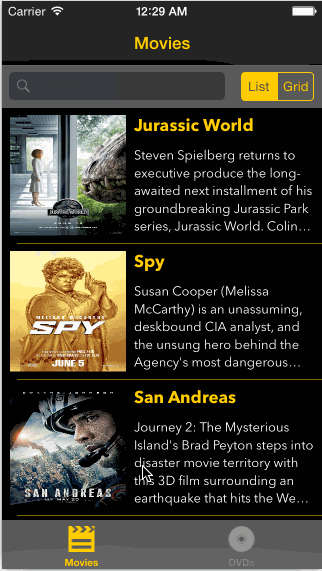

# iOS Training - Rotten Fruit

Project 1

Time spent: 16 hours

Completed user stories:

 * [x] User can view a list of movies from Rotten Tomatoes. Poster images must be loading asynchronously.
 * [x] User can view movie details by tapping on a cell.
         Hint: The Rotten Tomatoes API stopped returning high resolution images. To get around that, use the URL to the thumbnail poster, but replace 'tmb' with 'ori'.
 * [x] User sees loading state while waiting for movies API. You can use one of the 3rd party libraries at http://cocoapods.wantedly.com?q=hud.
 * [x] User sees error message when there's a networking error. You may not use UIAlertView or a 3rd party library to display the error. See this screenshot for what the error message should look like: network error screenshot.
 * [x] User can pull to refresh the movie list. Guide: Using UIRefreshControl
 * [x] Add a tab bar for Box Office and DVD. (optional)
 * [x] Implement segmented control to switch between list view and grid view (optional)
         Hint: The segmented control should hide/show a UITableView and a UICollectionView
 * [x] Add a search bar. (optional)
         Hint: Consider using a UISearchBar for this feature. Don't use the UISearchDisplayController.
 * [x] All images fade in (optional)
         Hint: Use the - (void)setImageWithURLRequest:(NSURLRequest *)urlRequest method in AFNetworking. Create an additional category method that has a success block that fades in the image. The image should only fade in if it's coming from network, not cache.
 * [x] For the large poster, load the low-res image first, switch to high-res when complete (optional)
 * [x] Customize the highlight and selection effect of the cell. (optional)
 * [x] Customize the navigation bar. (optional)

Walkthrough of all user stories:

GIF created with [LiceCap](http://www.cockos.com/licecap/).
